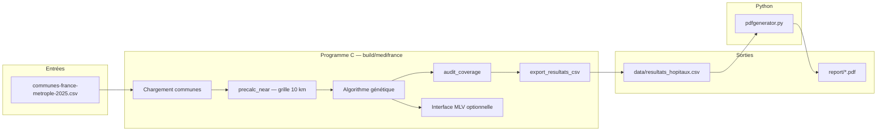

# MediFrance

Projet de géomatique et santé publique (ESIEE, S2) : optimiser la répartition des hôpitaux en **France métropolitaine** (Corse et DOM-TOM exclus) à l’aide d’un **algorithme génétique**.

L’objectif est de maximiser la population couverte dans un rayon de **10 km** autour de chaque hôpital, tout en limitant le nombre d’établissements (coût) et en favorisant les **CHRU** sur les grandes communes.

---

## Vue d’ensemble du flux



### En une exécution typique

1. **Charger** ~34 000 communes (population, latitude, longitude).
2. **Précalculer** pour chaque commune la liste des voisins à ≤ 10 km (accélération massive de la fitness).
3. **Faire évoluer** une population de solutions (où placer les hôpitaux).
4. **Auditer** la meilleure solution (cohérence géographique).
5. **Exporter** un CSV commune par commune.
6. *(Optionnel)* Générer un **rapport PDF** département par département.

---

## Structure du dépôt

| Chemin | Rôle |
|--------|------|
| `main.c` | Point d’entrée : chargement CSV, boucle GA, logs, export, GUI |
| `main.h` | Structure `Town` (commune) |
| `modules/gen.c` / `gen.h` | Précalcul voisins, fitness, sélection, croisement, mutation, audit |
| `modules/export.c` | Écriture de `data/resultats_hopitaux.csv` |
| `modules/gui.c` | Carte MLV + courbe de fitness en temps réel |
| `data/communes-france-metrople-2025.csv` | Données d’entrée (métropole) |
| `data/resultats_hopitaux.csv` | Résultat du meilleur individu (généré) |
| `scripts-pdf-generation/pdfgenerator.py` | Rapport PDF à partir du CSV |
| `assets/` | Polices DejaVu et logos pour le PDF |
| `report/` | PDF et cartes générés |

---

## Modèle du problème

### Une solution = un individu

Chaque **individu** du GA est un chromosome binaire de taille `N` (nombre de communes) :

- `genes[i] = 1` → un hôpital est placé sur la commune `i`
- `genes[i] = 0` → pas d’hôpital sur cette commune

On ne déplace pas des hôpitaux existants : on **choisit des communes** où ouvrir (ou maintenir) un établissement dans le modèle de simulation.

### Couverture (règle des 10 km)

Une commune est **couverte** si :

- elle porte un hôpital (`gene = 1`), **ou**
- elle figure dans la liste des **voisins** (distance ≤ 10 km) d’au moins un hôpital.

La distance est calculée en kilomètres à partir des coordonnées GPS (approximation locale avec latitude moyenne pour la longitude).

### Fonction de fitness (à maximiser)

Pour chaque individu, après parcours de tous les hôpitaux et marquage des communes couvertes :

```
fitness = population_totale_métropole
        - population_en_désert
        - (5000 × nombre_d_hôpitaux)
        + (4000 × nombre_de_CHRU)
```

| Terme | Signification |
|-------|----------------|
| `population_en_désert` | Habitants des communes non couvertes |
| `5000 × hôpitaux` | Pénalité par établissement (évite la sur-densité) |
| `4000 × CHRU` | Bonus si l’hôpital est sur une commune > 80 000 hab. (éligible CHRU) |

Les **lits** (5,4 pour 1 000 habitants couverts par hôpital) sont calculés pour l’export et les logs, mais ne entrent pas directement dans la fitness.

Plus la fitness est **élevée**, meilleure est la solution.

---

## Précalcul des voisins (`precalc_near`)

Évaluer la fitness pour ~34 000 communes × 200 individus × 1 000 générations serait prohibitif sans structure spatiale.

### Grille spatiale

1. La France est découpée en cellules de **0,1°** (~11 km).
2. Chaque commune est indexée dans sa cellule `(ligne, colonne)`.
3. Pour chaque commune, on inspecte une fenêtre **5×5** de cellules (`CELL_SEARCH_RADIUS = 2`) et on ne garde que les communes à **≤ 10 km** (distance symétrique).

Résultat stocké dans `OptimizedData` :

- `neighbors[]` — indices des communes voisines
- `neighbor_count`
- `is_eligible_for_chru` — population locale > 80 000
- `max_covered_population` — population de la commune + voisins (utile à la mutation)

---

## Algorithme génétique (détail)

Paramètres par défaut dans `main.c` :

| Paramètre | Valeur | Rôle |
|-----------|--------|------|
| `POP_SIZE` | 200 | Taille de la population |
| `GEN_MAX` | 1000 | Nombre de générations |
| `ELITISM_COUNT` | 15 | Meilleurs conservés tels quels |
| `TOURNAMENT_PROBABILITY` | 80 % | Probabilité de sélection par tournoi |
| `TOURNAMENT_SIZE` | 10 | Candidats tirés par parent |
| OpenMP | jusqu’à 12 threads | Fitness et reproduction parallèles |

### Initialisation

Pour chaque individu et chaque commune :

- Si la zone peut couvrir > 30 000 hab. (`max_covered_population`) : **20 %** de chance d’y placer un hôpital au départ.
- Sinon : **0,2 %** de chance (`STARTING_HOSPITALS_PROBABILITY`).

La population de départ est donc très dense en hôpitaux ; la sélection fait converger vers moins d’établissements mais mieux placés.

### Boucle par génération (`main.c`)

```
Pour gen = 0 .. GEN_MAX-1 :
  1. FITNESS   — calcul parallèle pour chaque individu (workspaces par thread)
  2. TRI       — quick_sort décroissant sur fitness
  3. ÉLITISME  — copie des 15 meilleurs vers next_population
  4. REPRO     — pour les 185 autres :
       - 80 % : deux parents choisis par tournoi (meilleur parmi 10 tirages dans la moitié supérieure)
       - 20 % : copie d’un individu aléatoire du top 20
       - crossover en 3 segments (deux pivots)
       - mutation
  5. SWAP      — next_population devient la population courante
```

### Croisement (`crossover`)

Deux pivots aléatoires découpent le chromosome en trois morceaux : segments alternés parent 1 / parent 2 / parent 1.

### Mutation (`mutate`)

- **Ajouts** : 3 à 10 communes tirées au hasard ; on pose un hôpital si `max_covered_population ≥ 5000` (seuil = coût hôpital).
- **Suppressions** (80 % de chance) : 3 à 10 fermetures d’hôpitaux existants tirées au hasard.

La mutation est agressive pour explorer ; l’élitisme et la fitness stabilisent les bonnes configurations.

---

## Flux détaillé du programme C

```
main()
│
├─ Charger CSV → tableau Town[] (x = longitude, y = latitude)
├─ set_habitants_total(somme des populations)
├─ Allouer workspaces OpenMP (buffer couverture par thread)
├─ precalc_near() → OptimizedData[]
├─ Allouer population + next_population (gènes par individu)
├─ Initialiser les gènes aléatoirement
│
├─ [optionnel] init_window() — sauf MEDIFRANCE_HEADLESS=1
│
├─ FOR gen in 0..GEN_MAX-1
│     ├─ fitness() × POP_SIZE  (parallèle)
│     ├─ quick_sort_population()
│     ├─ copie élite
│     ├─ crossover + mutate (parallèle)
│     ├─ swap buffers
│     └─ logs + fitness_graph (GUI)
│
├─ log_solution_details + bilan évolution
├─ audit_coverage() — vérifie déserts / couverture vs 10 km
├─ export_resultats_csv("data/resultats_hopitaux.csv")
└─ [optionnel] settings_menu() — carte + hôpitaux du meilleur individu
```

### Fichier exporté (`export.c`)

Une ligne par commune :

| Colonne | Description |
|---------|-------------|
| `nom_dep` | Département |
| `ville` | Nom de la commune |
| `population` | Population |
| `has_hospital` | 1 si gène = 1 |
| `is_desert` | 1 si non couverte par le modèle |
| `nb_beds` | Lits attribués à l’hôpital local (0 sinon), min. 10 si hôpital |

---

## Rapport PDF (Python)

Après l’exécution du binaire C :

```bash
pip install -r scripts-pdf-generation/requirements.txt
python3 scripts-pdf-generation/pdfgenerator.py
```

Le script lit `data/resultats_hopitaux.csv`, fusionne les coordonnées depuis le CSV communes, et produit `report/couverture_hospitaliere_optimale_france.pdf` (statistiques et tableaux par département).

**Dépendances :** `pandas`, `fpdf2` (pas le paquet `fpdf` 1.x), éventuellement `matplotlib` si des cartes sont activées dans votre version du script.

---

## Installation et compilation (Linux)

### Prérequis

- `gcc`, `make`, `pkg-config`
- **libMLV** (`MLV/MLV_all.h`) — interface graphique
- `cppcheck` (via `setup.sh`)

> `setup.sh` utilise `apt-get` (Debian/Ubuntu/Fedora avec équivalents).

### Qualité (pre-commit)

```bash
chmod +x setup.sh
./setup.sh
```

### Compiler

```bash
make
# → build/medifrance
```

### Lancer

```bash
./build/medifrance
```

### Mode headless (sans fenêtre MLV)

Utile sur serveur ou pour enchaîner avec le PDF :

```bash
MEDIFRANCE_HEADLESS=1 ./build/medifrance
```

### Logs

Par défaut, un résumé est affiché **toutes les 50 générations** (+ dernière génération, précalcul, audit, export).

```bash
MEDIFRANCE_LOG_EVERY=100 MEDIFRANCE_HEADLESS=1 ./build/medifrance
```

Préfixes utiles : `[config]`, `[precalc]`, `[gen N]`, `[final]`, `[bilan]`, `[audit]`, `[export]`.

### Nettoyer

```bash
make clean
```

---

## Paramètres modifiables

Les constantes principales sont en tête de `main.c` (taille population, générations, tournoi, élitisme) et dans `modules/gen.c` (rayon 10 km, coûts, mutation). Après modification : `make` puis relancer.

---

## Limites du modèle (à connaître)

- **Métropole uniquement** dans le CSV fourni.
- Un hôpital par **commune** simulée, pas la liste réelle des établissements existants.
- Couverture en **vol d’oiseau** 10 km, pas temps de trajet.
- Les voisins sont des **enveloppes** précalculées ; l’audit en fin de run vérifie la cohérence géographique.
- La fitness favorise la population couverte, pas l’équité fine entre départements (des écarts de lits par zone peuvent subsister).

---

## Licence

Voir [LICENSE](LICENSE).
